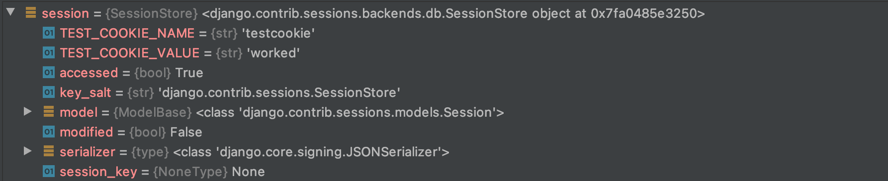

# Session 기능

django 에서 제공하는 로그인 기능을 배워 봅니다. 

## Session 이란? 
> 세션이라는 것은 Django 그리고 대부분의 인터넷에서 사용되는 메카니즘으로, **사이트와 특정 브라우저 사이의 "state"**를 유지시키는 것입니다. 
세션은 당신이 매 브라우저마다 임의의 데이터를 저장하게 하고, 이 데이터가 브라우저에 접속할 때 마다 사이트에서 활용될 수 있도록 합니다. 
세션에 연결된 각각의 데이터 아이템들은 "key"에 의해 인용되고, 이는 또다시 데이터를 찾거나 저장하는 데에 이용됩니다.

내용이 어려운데 아래와 같이 정의할수 도 있다. 

> 세션이란 일정 시간동안 같은 사용자(정확하게 브라우저를 말한다)로 부터 들어오는
일련의 요구를 하나의 상태로 보고 그 상태를 일정하게 유지시키는 기술이라고 한다.
또한 여기서 일정 시간이란 방문자가 웹 브라우저를 통해 웹 서버에 접속한 시점으로부터 웹 브라우저를 종료함으로써 연결을 끝내는 시점을 말하며
즉, 방문자가 웹서버에 접속해 있는 상태를 하나의 단위로 보고 세션이라고 칭한다는 것.
> 세션은 방문자의 요청에 따른 정보를 방문자 메모리에 저장하는 것이 아닌 웹 서버가 세션 아이디 파일을 만들어 서비스가 돌아가고 있는 서버에 저장을 하는것을 말한다.

즉 Session id 을 일시적으로 만들어 인증된 회원에게 부여한다는 의미이다.
아래 순서로 만들어 진다.  

> 1) session이란 서버가 해당 서버(웹)로 접근(request)한 클라이언트(사용자)를 식별하는 방법
> 2) 서버(웹)는 접근한 클라이언트(사용자)에게 response-header field인 set-cookie 값으로 클라이언트 식별자인 session-id(임의의 긴 문자열)를 발행(응답)한다.
> 3) 서버로부터 발행(응답)된 session-id는 해당 서버(웹)와 클라이언트(브라우저) 메모리에 저장된다. 이때 클라이언트 메모리에 사용되는 cookie 타입은 세션 종료 시 같이 소멸되는 "Memory cookie"가 사용된다.

## Django 에서 Session 사용 하기
Session 을 사용하기 위해서 필요한 것들은 인증(Auth) 기능일 것입니다. 
즉 인증 받은 회원에게 **일정 기간동안 고유의 id** 을 부여해야 하니 말이죠 

### 
장고는 특정 session id 를 포함하는 쿠키를 사용해서 각각의 브라우저와 사이트가 연결된 세션을 알아냅니다. 
실질적인 세션의 data 사이트의 Database에 기본 설정값으로 저장됩니다 
(이는 쿠키안에 데이터를 저장하는 것보다 더 보안에 유리하고, 쿠키는 악의적인 사용자에게 취약합니다).
 당신은 Django를 다른 장소 (캐시, 파일, "보안이 된" 쿠키)에 저장하도록 설정할 수 있지만, 그러나 기본 위치가 상대적으로 더 안전합니다.
 
 세션설정은 처음에 skeleton website를 생성했을 때 (in tutorial 2) 자동으로 사용할 수 있도록 설정되었습니다. 

세션사용설정은 프로젝트 settings.py에서 아래와 같이 INSTALLED_APPS 와 MIDDLEWARE 부분에 있습니다.

INSTALLED_APPS = [
    ...
    'django.contrib.sessions',
    ....

MIDDLEWARE = [
    ...
    'django.contrib.sessions.middleware.SessionMiddleware',
    ....
    
    
Session 특성 정보는 view 에 들어오는 request 에 들어 있습니다.  

